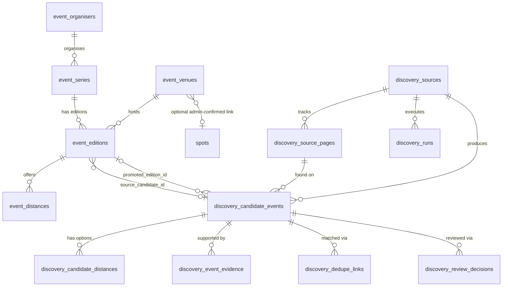

# Global Swim Discovery — Database Schema

Phase 2 (database foundation). Companion to
`sql/applied/2026-08-03_discovery-schema-v1.sql`, **applied to production
on 2026-08-03**.

Verified after apply: 13 tables, 13 RLS enabled, 1 view, 16 policies (all
`SELECT`, zero write policies), `swim_events` unchanged at 32 columns,
19/19 constraint tests passed in a rolled-back transaction, and the
external RLS probe at 31 passed / 0 failed. All 13 tables are empty —
nothing has been seeded.

Nothing in this document changes `public.swim_events`, `public.profiles`,
`public.spots`, or any existing RLS policy.

---

## 1. Two separate groups of tables

The migration creates thirteen tables in two distinct groups that must
not be confused with each other.

### Group A — the published event catalogue (public)

| Table | Holds | Public? |
|---|---|---|
| `event_organisers` | Third-party organisers (clubs, promoters, charities) | **No direct public access** — read via the `public_organisers` view |
| `event_venues` | Places events happen | Read-only |
| `event_series` | The enduring event identity across years | Read-only |
| `event_editions` | One specific running of a series | Read-only, `unconfirmed` hidden |
| `event_distances` | One row per enterable distance/wave | Read-only, inherits edition visibility |

Plus one view:

| View | Purpose |
|---|---|
| `public_organisers` | The public read surface for organisers. Excludes `email`/`phone`, exposes only `status='active'` rows. Follows the existing `public_profiles` precedent. |

Rows arrive here **only** through admin approval. The worker can never
write to them.

### Group B — the discovery pipeline (never public)

| Table | Holds |
|---|---|
| `discovery_sources` | The approved source registry, with health and scheduling |
| `discovery_source_pages` | Per-URL retrieval history and content hashes (change monitoring) |
| `discovery_runs` | One row per worker execution, with counters and retry state |
| `discovery_candidate_events` | The candidate itself — the DB form of the Phase 1 `CandidateEvent` |
| `discovery_candidate_distances` | Structured distance options per candidate |
| `discovery_event_evidence` | Field-addressable provenance for each extracted value |
| `discovery_dedupe_links` | Scored possible-duplicate relationships, and their resolution |
| `discovery_review_decisions` | Append-only audit of every admin review action |

Written by the worker using the **service-role key**, which bypasses RLS.
Read by admins only. No client role can write to any of them.

---

## 2. Relationships



### The circular reference, and how it is resolved

`event_editions.source_candidate_id` points at a candidate, and
`discovery_candidate_events.promoted_edition_id` points back at an
edition. This is genuinely circular, and both directions are wanted:
provenance forward, and idempotency backward.

It is resolved by creation order, not by dropping one side:

1. `event_editions` is created with `source_candidate_id` as a plain
   nullable `uuid` column with **no** inline foreign key.
2. `discovery_candidate_events` is created later, with its
   `promoted_edition_id` FK declared inline (by then `event_editions`
   exists).
3. A single `ALTER TABLE ... ADD CONSTRAINT` at the end adds the missing
   FK on `event_editions.source_candidate_id`, guarded by a
   `pg_constraint` existence check so re-running is safe.

Both FKs are `ON DELETE SET NULL`, never `CASCADE`. Deleting a candidate
must never cascade into deleting a published event, and deleting an
edition must never delete discovery history.

---

## 3. RLS model

RLS is enabled on all thirteen tables. Table grants are **also** locked
down, because in Supabase table privileges are evaluated *before* row
policies — RLS alone is not sufficient if `anon` holds a broad grant.

| Role | Published catalogue | Discovery tables |
|---|---|---|
| `anon` | `SELECT` on venues/series/editions/distances, and on the `public_organisers` view. **No grant at all on `event_organisers`.** `event_editions` with `status='unconfirmed'` are hidden, and their distances with them. | **No grant at all.** Not even reachable. |
| `authenticated` (ordinary) | Same as `anon`. Holds a table grant on `event_organisers`, but the admin-only RLS policy returns **zero rows** — so organisers are reached via the view here too. No write access. | Table grant exists so the admin policy can be evaluated, but the RLS policy returns **zero rows** for non-admins. |
| `authenticated` (admin, `profiles.is_admin = true`) | Can additionally read `unconfirmed`/archived rows and the full `event_organisers` table including contact details. **No write policy.** | `SELECT` on every discovery table. **No write policy.** |
| `service_role` (worker) | n/a — the worker never writes here | Full access by bypassing RLS. No policy needed or created. |

### Why a view rather than column grants for organisers

`event_organisers` is the only published table with columns that must not
be public (`email`, `phone` — organisation contact details). Column-level
`GRANT SELECT (col, ...)` would work, but it breaks `SELECT *` for `anon`,
which is a sharp edge for every future Explore query.

Instead the table gets **no public read policy at all**, and public access
goes through `public_organisers` — a plain (non-`security_invoker`) view,
so it executes with the view owner's privileges and `anon` needs no grant
on the underlying table. Because it deliberately bypasses the table's RLS,
the "only active organisers are public" rule lives **inside the view**
(`WHERE status = 'active'`), which makes it self-contained: a future policy
change on the table cannot silently widen what the view exposes.

This is exactly the existing `public_profiles` pattern.

**Explore pages must read `public_organisers`, never `event_organisers`.**

### Why admins get no write policy

Deliberate. Candidate approval will happen through one atomic
`SECURITY DEFINER` RPC that locks the candidate, validates it, creates
the edition and distances, records the decision, and marks the candidate
approved — all in one transaction. A permissive admin `UPDATE` policy
would let the browser bypass that RPC and perform a half-completed
promotion. So the schema ships with **no write policy on any of the
thirteen tables**, for any client role.

Verification query 3 in the migration asserts exactly this: zero
non-`SELECT` policies across all thirteen tables.

### Relationship to the `is_admin` protection

Every admin policy is gated on `profiles.is_admin`, which currently sits
on a self-updatable row (`sql/2026-08-03_protect-profiles-is-admin.sql`
closes that, and is also not yet applied).

Ordering between the two migrations is **not enforced**. The `is_admin`
hole pre-dates this work and already unlocks more sensitive capabilities
than this schema adds — `domains` management, `spotlights`, `temp_logs`
DELETE, and the UK-challenge admin functions. What this migration adds to
that set is read-only access to scraped public event data. Applying this
one first is therefore a low-marginal-risk choice, taken deliberately so
discovery work isn't blocked.

The follow-up still matters; it just isn't a gate.

---

## 4. Candidate-to-publication flow

```
  worker (service role, fixtures today / live sources later)
        │
        │  upsert on (source_id, candidate_key)
        ▼
  discovery_candidate_events        ← discovery_candidate_distances
        │                           ← discovery_event_evidence
        │                           ← discovery_dedupe_links
        │
        │  admin reviews in the (future) admin UI — read-only
        ▼
  [ future atomic approval RPC ]  ← the ONLY write path
        │
        ├── creates / reuses event_organisers, event_venues, event_series
        ├── creates event_editions  (+ source_candidate_id back-reference)
        ├── creates event_distances from discovery_candidate_distances
        ├── sets candidate_status='approved', promoted_edition_id=<new edition>
        └── appends a discovery_review_decisions row
                │
                ▼
        public Explore pages read the published catalogue only
```

### Idempotency, designed in now

Two schema features exist specifically so the future RPC can be safely
retried:

- `UNIQUE (source_id, candidate_key)` — re-extracting the same event from
  the same source **updates** the candidate rather than duplicating it.
  Scoped per source, not globally, because two different sources
  describing one real event are two legitimate candidates; that
  relationship belongs in `discovery_dedupe_links`.
- `CHECK (promoted_edition_id IS NULL OR candidate_status = 'approved')`
  — a candidate can only point at a published edition once approved. The
  RPC reads `promoted_edition_id` under `SELECT ... FOR UPDATE`; if it is
  already set, it returns that edition instead of creating a second one.

The reverse implication (approved ⟹ promoted) is deliberately **not** a
CHECK constraint. Because `promoted_edition_id` is `ON DELETE SET NULL`,
a biconditional constraint would make deleting any published edition fail
with a check violation on a different table. That direction is guaranteed
by the RPC's transaction instead.

### Duplicate-edition guard

`UNIQUE (series_id, edition_year, COALESCE(venue_id, <sentinel>))`.
Keyed on venue as well as year so a series that legitimately runs two
editions in the same year at *different* locations is not incorrectly
blocked, while two venue-less editions of the same series and year still
collide. Same `COALESCE`-in-a-unique-index idiom already used by the
repo's `user_roles` design.

---

## 5. Why `swim_events` stays separate

`public.swim_events` is untouched and keeps its existing meaning.

| | `swim_events` | `event_editions` |
|---|---|---|
| Created by | A SwimLoading user (`created_by → auth.users`) | Admin approval of a discovered candidate |
| Attendance | `swim_participants` RSVP, emergency contacts, re-confirm flow | None — you enter on the organiser's own site |
| Recurrence | `recurrence_series_id` batch, capped at 52 client-generated rows | `event_series` → yearly `event_editions` |
| Provenance | None needed — the creator is a known user | `source_candidate_id`, evidence, confidence score |
| Lifecycle | `status` free text, convention-only | Constrained `status` + independent `registration_status` |

A discovered third-party race has no SwimLoading creator, no RSVP
mechanism, and needs provenance and verification that `swim_events` has
no concept of. Forcing them into one table would mean either polluting
`swim_events` with fifteen nullable discovery columns and weakening its
existing RLS, or misrepresenting community group swims as catalogue
entries. Neither is acceptable, so they stay separate and are joined only
at the query layer when a page genuinely needs both.

---

## 6. Why `event_venues` stays separate from `spots`

`spots` is the **swimmer temperature-logging** domain. Every row drives
temperature charts, the `spot_temp_estimate` confidence view, the marine
temperature cron, the Passport, and the admin spot-curation workflow.

A discovered race start line is not automatically a place anyone logs
temperatures at. Auto-creating a `spots` row for every discovered venue
would:

- inflate the spot count that appears across the marketing pages and
  `site-config.js`;
- add venues to the spot picker that no swimmer ever logs at;
- feed the marine-temperature cron with coordinates nobody asked for;
- couple two unrelated admin workflows.

So `event_venues` is its own light table, and `event_venues.spot_id` is an
**optional, admin-confirmed** link. The migration never creates or links a
spot automatically.

---

## 7. Future work (explicitly not in this phase)

1. **Atomic approval RPC** — `approve_discovery_candidate(candidate_id, ...)`,
   `SECURITY DEFINER`, locking the candidate `FOR UPDATE`, returning the
   existing `promoted_edition_id` on retry. The schema is shaped for it;
   the function is not written.
2. **Fixture-to-database persistence** — the Phase 1 worker currently
   writes only to `discovery-worker/out/*.json`. The next phase adds a
   service-role Supabase client behind `DISCOVERY_WRITE_ENABLED=true`,
   writing the same `CandidateEvent` shape into
   `discovery_candidate_events` + `discovery_candidate_distances` +
   `discovery_event_evidence`, still from fixtures only.
3. **Live fetching, Playwright, AI fallback** — all still gated off.
4. **Public Explore pages and the admin review UI** — both read-only
   consumers of this schema, neither built yet.

---

## 8. Files

| File | Status |
|---|---|
| `sql/applied/2026-08-03_discovery-schema-v1.sql` | ✅ **Applied 2026-08-03** |
| `sql/applied/2026-08-03_discovery-schema-v1-tests.sql` | Constraint tests, transactional, ends in `ROLLBACK`. 19/19 passing. |
| `scripts/test-discovery-schema-rls.mjs` | RLS/grant probe, read-only by default. 31 passed / 0 failed. |
| `sql/2026-08-03_protect-profiles-is-admin.sql` | ⚠️ **Still not applied** — follow-up, see above |
